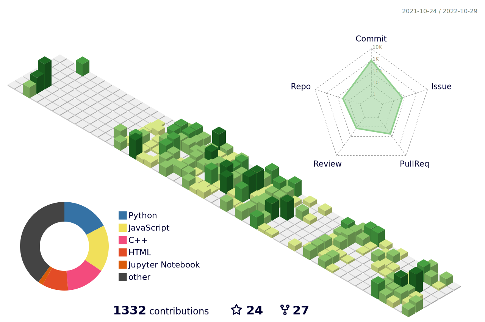

<!-- 

 -->

# Hey there👋, Welcome to my Github Profile

 
 
- <i>Software Engineer focused on cloud native distributed systems, building products for startups and big tech. Equipped with a diverse skill-set and problem solving ability, placing a special emphasis on system level thinking and good quality code. Also regularly write technical blogs and articles for various popular tech sites. I host my personal projects ( code & infra ), along with elaborate documentation here, and also the open source repositories I have contributed to</i>

&nbsp;   &nbsp;&nbsp;  &nbsp;&nbsp;&nbsp;&nbsp;  &nbsp;&nbsp; 

 
<!---

kaustav202/kaustav202 is a ✨ special ✨ repository because its `README.md` (this file) appears on your GitHub profile.
You can click the Preview link to take a look at your changes.

--->

 
 
 <h2> &nbsp;&nbsp;&nbsp;⚡🙋‍♂️ About.. </h2> 

 

 
 

- 🎨 I’m currently involved in...  building stuff, contributing to the community, and learning!
- 🗃️ My Stacks 👉  **MERN** , **RDS** (Django), **ELK**
- 💡 I’m curious about ...**Blockchain** and **Generative AI**.
- 🤖 profile outlook.. **SDE**/ **Data Engg.**/ **Cloud**/ **Devops/MLops**
- ❄️ I’m looking to collaborate on... useful Open Source Projects.
- 🤝 Get in touch to.. participate in hackathons or coding competetions (Team)
- 📩 How to reach me ... **check out my socials** [below👇](https://github.com/kaustav202#----connnect-with-me)**!!**

 
 
 

 

<table width="100%" >

 <tr>
    <td width="60%">
     
## 🛠️ Skills

#### Languages

&nbsp;
&nbsp;
&nbsp;
&nbsp;

#### Development
&nbsp;
&nbsp;

&nbsp;
&nbsp;

     
<!--      

&nbsp; -->

#### Database

&nbsp;
&nbsp;

#### Tools and Technologies

&nbsp;
&nbsp;
&nbsp;

<!--  -->
<!--  -->
<!-- &nbsp; -->

#### Data and Devops 

</td>
    <td>
  
## 📄📜 Stats [Dynamic🚀]

  
  
  
  
  

     
  </td>
 </tr>
</table>

<!--

<!--
 

<h2> 📌🏴  Coding Profiles </h2>

 
 

 &nbsp;&nbsp;&nbsp; &nbsp;&nbsp;&nbsp;&nbsp;  &nbsp; &nbsp;&nbsp;&nbsp; &nbsp; &nbsp;&nbsp;&nbsp; &nbsp;  &nbsp;

-->

 

<!--

  
 <h3> Post Links </h3> 

   

  
 
  
 
 
 
 
 
 
 

  

-->

 
 

 
  <h3>  </h3>
  
  <h2> &nbsp;  Featured Repositories 🚀 </h2>
  
 

 

  &nbsp;&nbsp; &nbsp; &nbsp;

 

&nbsp;&nbsp;&nbsp;&nbsp;

 

 &nbsp; &nbsp;&nbsp;&nbsp;

 

<!--

## Banner

## Update About

## Metrics

## Code Snippet Gif/ Anime

## Resize

## Pinned Repositories

## Open Source Programs

## Achievements Section

-->

<!-- 
Navigation Options  
-->

<!-- 
Featured Repositories.
 -->

 
<!-- 

 
 
 <h2> Here are some highlights of my open source journey </h2> 

 
 
 

  
 <h2>  
 
   👆 Click To Expand!! </h2> 

  
  <table>
   <h2> Section Link </h3> 
 <tr>
 <td>  </td>
 <td>  </td>
 </tr>
 </table>
  

 

  
 Open Source Work 

  
   <table>
     
   <td> </td>
   <td> </td>
     
 
 </table>
  

 
 
 

  
 Useful Repos and Important Code 

  
   <table>
     
   <td> </td>
   <td> </td>
     
 
 </table>
  

 
  

  
 Others's collaboration my repos 

  
   <table>
     
  <tr>   
      
    </tr>   
 
 </table>
  

 -->
  
<!-- ## Here are some highlights of my open source journey 

 ### - Activity Smmary and Overview

## Here are some of my works
 -->

 
 

##   🗓️&nbsp; &nbsp;  Activity Overview
 
 &nbsp; &nbsp;

<h4 width="15%" align="left"> Recent Activity </h4> 
 
<!-- 

<!--RECENT_ACTIVITY:start-->
1. ⬆️ Pushed 1 commit(s) to [kaustav202/Problem-Solving-Techniques](https://github.com/kaustav202/Problem-Solving-Techniques)
2. ⬆️ Pushed 1 commit(s) to [kaustav202/Problem-Solving-Techniques](https://github.com/kaustav202/Problem-Solving-Techniques)
3. ⬆️ Pushed 1 commit(s) to [kaustav202/Problem-Solving-Techniques](https://github.com/kaustav202/Problem-Solving-Techniques)
4. ⬆️ Pushed 1 commit(s) to [kaustav202/Portfolio](https://github.com/kaustav202/Portfolio)
5. ⬆️ Pushed 1 commit(s) to [kaustav202/Portfolio](https://github.com/kaustav202/Portfolio)
6. ⬆️ Pushed 1 commit(s) to [kaustav202/Portfolio](https://github.com/kaustav202/Portfolio)
7. ⬆️ Pushed 1 commit(s) to [kaustav202/Portfolio](https://github.com/kaustav202/Portfolio)
8. ⬆️ Pushed 1 commit(s) to [kaustav202/Problem-Solving-Techniques](https://github.com/kaustav202/Problem-Solving-Techniques)
9. ⬆️ Pushed 1 commit(s) to [kaustav202/Problem-Solving-Techniques](https://github.com/kaustav202/Problem-Solving-Techniques)
10. ⬆️ Pushed 1 commit(s) to [kaustav202/Problem-Solving-Techniques](https://github.com/kaustav202/Problem-Solving-Techniques)
11. ⬆️ Pushed 1 commit(s) to [kaustav202/Problem-Solving-Techniques](https://github.com/kaustav202/Problem-Solving-Techniques)
12. ⬆️ Pushed 1 commit(s) to [kaustav202/Problem-Solving-Techniques](https://github.com/kaustav202/Problem-Solving-Techniques)
<!--RECENT_ACTIVITY:end-->

 

  <table  >
 <tr>

  <td width="65%" align = "left">

  <h3>  &nbsp; &nbsp; <b> 📕 </b> &nbsp;Recent Articles and Blog Posts  </h3>

   <h4>  &nbsp; &nbsp; &nbsp; &nbsp; &nbsp; &nbsp; &nbsp; Source➡️ medium.com </h4>

   
<!-- BLOG-POST-LIST:START -->
- [Security Vulnerabilities in Digital Wallets based on Ethereum Ecosystem and Other Blockchain…](https://medium.com/@kaustav_g/security-vulnerabilities-in-digital-wallets-based-on-ethereum-ecosystem-and-other-blockchain-bca3ae860f8d?source=rss-d1e37ddd01e4------2)
- [An outline to Virtualization in IT systems and Software Engineering — why it’s more significant…](https://medium.com/@kaustav_g/an-outline-to-virtualization-in-it-systems-and-software-engineering-why-its-more-significant-3c59007eb869?source=rss-d1e37ddd01e4------2)
- [Python tricks and techniques to help you get the most out of the language Part 1](https://medium.com/@kaustav_g/python-tricks-and-techniques-to-help-you-get-the-most-out-of-the-language-1-85741e608054?source=rss-d1e37ddd01e4------2)
- [Take your GitHub profile from zero to hero with these 10 hacks](https://medium.com/@kaustav_g/take-your-github-profile-from-zero-to-hero-with-these-10-hacks-b6b5ffe3d065?source=rss-d1e37ddd01e4------2)
- [How Open Source can be only thing you need to kickstart your journey as a software developer Part2](https://medium.com/@kaustav_g/how-open-source-can-be-only-thing-you-need-to-kickstart-your-journey-as-a-software-developer-part2-656cab3f4a82?source=rss-d1e37ddd01e4------2)
<!-- BLOG-POST-LIST:END -->

  </td>
  
<!--  <td width="600px">
   
   
 
   
  </td>
-->
  
 </tr>
 </table>
 
 
  

<!--
## &nbsp; &nbsp; &nbsp;🔥 Motto
&nbsp; &nbsp; &nbsp; &nbsp; &nbsp; &nbsp;&nbsp; 
-->

 <b style = {font-weight: 500}>Visitors</b>

  

 
 

 
<!-- 

  
  
  <h2> &nbsp;&nbsp; 🌟Profiles  </h2> 

  
   

  <a href = "https://github.com/kaustav202/kaustav202/blob/main/fun.md"> <h3>🔸🎮 Lots of other cool stuffs, trivia and info about me </h3> </a>
  
   
  
  <a href = "https://metrics.lecoq.io/about/kaustav202"><h3>🔸🚀  Checkout all my open source jorney and more metrics in this page </h3> </a>
  
   
  
  <a href = "https://kaustav-port.web.app/"><h3>🔸🎴 My Portfolio Website</h3></a>
  
   
   
  
 

 -->

## &nbsp; &nbsp; 📬📥 &nbsp; Connnect with Me

 

&nbsp; &nbsp; &nbsp; &nbsp;  &nbsp;&nbsp;&nbsp;
 &nbsp; &nbsp; 

 
 

<!--

-->

<!--

 
  

    
&nbsp;&nbsp;&nbsp;&nbsp;
    
  

 

-->

<!--
  
-->
