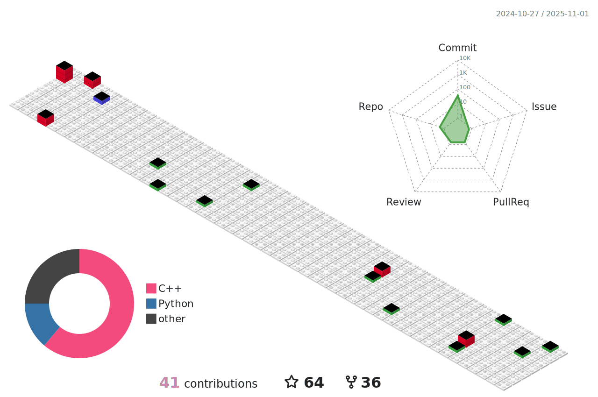

# Hey there👋, Welcome to my Github Profile

 
 
 
- <i>Aspiring software developer with good problem-solving skills. Able to perform well in a team. Passionate about coding and equipped with a diverse and promising skill-set with a special emphasis on writing good code. Also regularly write technical content and articles for various popular tech sites.</i>

## ⚡🙋‍♂️ About Me   

 

- 🔧 I’m currently working on ...Online Retail Community App.

- 💡 I’m curious about ...Blockchain and Crypto Currency.
- 📖 I’m currently learning ...Flask.
- ❄️ I’m looking to collaborate on ...Open Source Projects.
- 📫 How to reach me ...gkaustav57@gmail.com.

<!---

kaustav202/kaustav202 is a ✨ special ✨ repository because its `README.md` (this file) appears on your GitHub profile.
You can click the Preview link to take a look at your changes.

--->

 

## 🛠️ Skills

#### Languages

&nbsp;
&nbsp;
&nbsp;
&nbsp;

#### Development
&nbsp;
&nbsp;
&nbsp;
&nbsp;
&nbsp;
&nbsp;
<!-- &nbsp; -->

#### Database

&nbsp;
&nbsp;
&nbsp;

#### Tools and Technologies

&nbsp;
&nbsp;
&nbsp;
&nbsp;
&nbsp;
&nbsp;
&nbsp;

<!-- &nbsp; -->

#### Data Analytics 

&nbsp;
&nbsp;<!-- &nbsp; -->
&nbsp;
&nbsp;

<!--
#### Cloud Infrastructures

&nbsp;
&nbsp;
&nbsp;
&nbsp;

#### Environments

&nbsp;
&nbsp;
&nbsp;
&nbsp;
&nbsp;
&nbsp;
&nbsp;
-->

 

<!--

 

  
<h2> 📌🴠 Coding Profiles </h2>

 
 

 &nbsp;&nbsp;&nbsp; &nbsp;&nbsp;&nbsp;&nbsp;  &nbsp; &nbsp;&nbsp;&nbsp; &nbsp; &nbsp;&nbsp;&nbsp; &nbsp;  &nbsp;

-->

 

<!--

  
 <h3> Post Links </h3> 

   

  
 
  
 
 
 
 
 
 
 

  

-->

<!--

## Banner

## Update About

## Metrics

## Code Snippet Gif/ Anime

## Resize

## Pinned Repositories

## Open Source Programs

## Achievements Section

-->

## 📄📜 Activity Summary

  
  

 <b style = {font-weight: 600}>Visitors Count</b>

 
 

<!--  Only Opening comment tag , Update username in wf file to run

# 📕  Latest Blog Posts 

<!-- BLOG-POST-LIST:START -->
<!-- BLOG-POST-LIST:END -->

 
 
<!-- 

  
  
  <h2> &nbsp;&nbsp; 🌟Profiles  </h2> 

  
   

  <a href = "https://github.com/kaustav202/kaustav202/blob/main/fun.md"> <h3>🔸🎮 Lots of other cool stuffs, trivia and info about me </h3> </a>
  
   
  
  <a href = "https://metrics.lecoq.io/about/kaustav202"><h3>🔸🚀  Checkout all my open source jorney and more metrics in this page </h3> </a>
  
   
  
  <a href = "https://kaustav-port.web.app/"><h3>🔸🎴 My Portfolio Website</h3></a>
  
   
   
  
 

 -->

## 📬 Contact Info

 

 &nbsp;
 &nbsp;

 
 

<!--

 
  

    
&nbsp;&nbsp;&nbsp;&nbsp;
    
  

 

-->

<!--
  -->

<!--  -->
